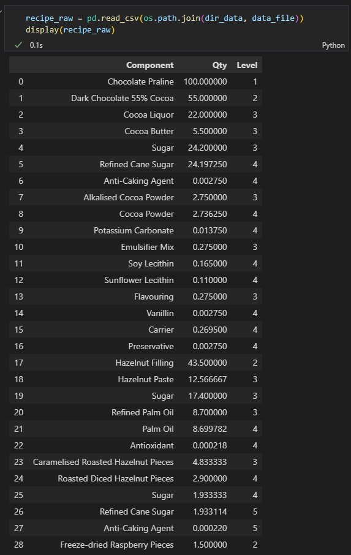
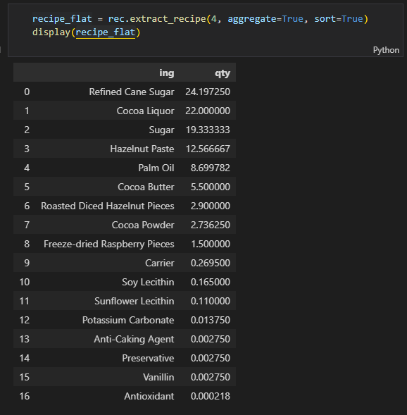

# Recipe Recursion
## Using Object-oriented programming and recursion to process hierarchical formulation data

This repository contains a class to process hierarchical formulation data into a single-level flat formulation.

With its `extract_recipe` method, the `Recipe` class recursively extracts each component's contribution to the overall recipe.

*Example of formulation data in a hierarchical format:*

*Example of formulation data in a flat format as processed by the `Recipe` class' `extract_recipe` method:*

***

## Questions and Feedback

For questions or feedback please contact me via [LinkedIn](https://www.linkedin.com/in/jeandsantos/) or [email](mailto:jeandsantos88@gmail.com?subject=Recipe%20Recursion%3A%20Questions%20and%20Requests).

For fixes or new feature request feel free to raise an issue.